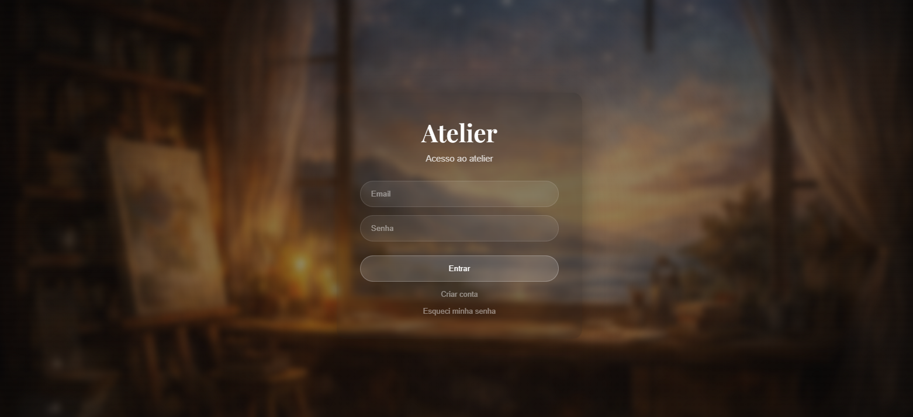
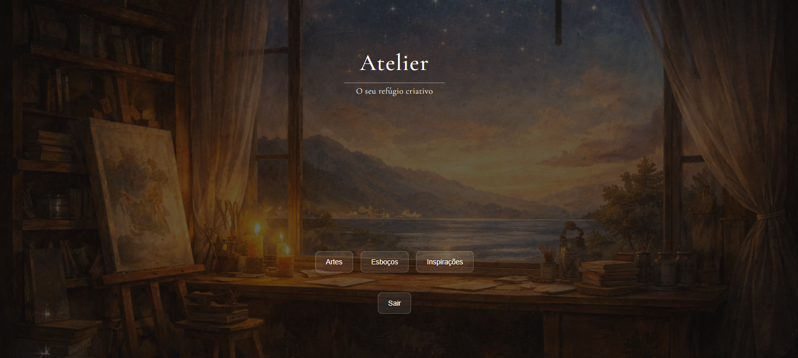
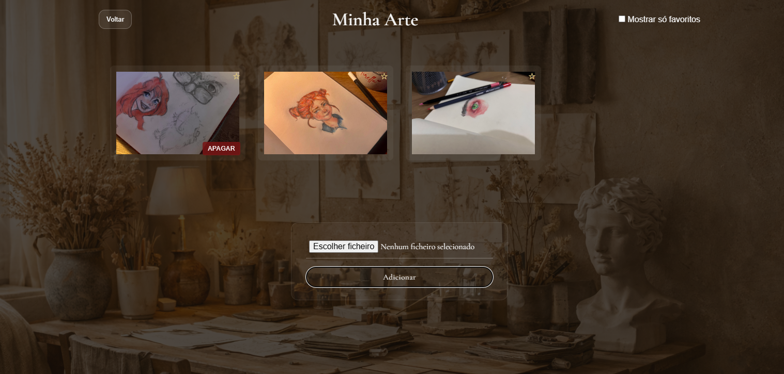
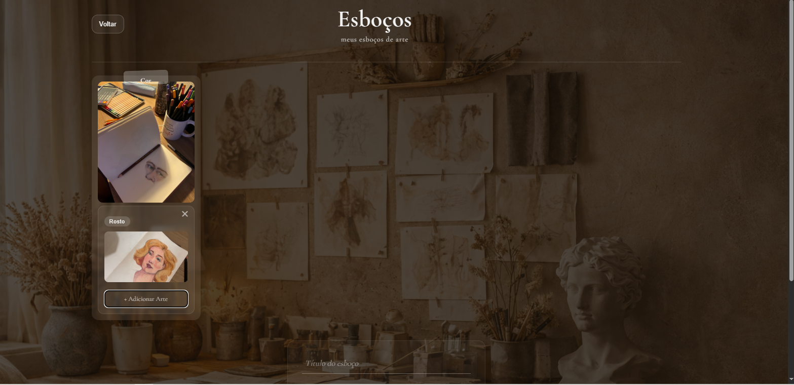
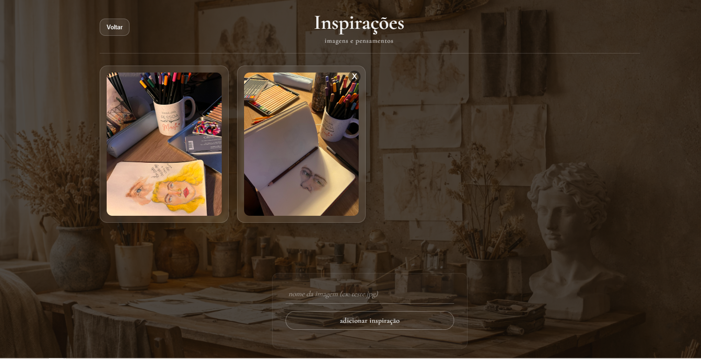

# Atelier

> *"Um espaço para guardar o que você cria."*

O Atelier é um sistema web pessoal para guardar artes, esboços e inspirações. Cada usuário tem seu próprio acervo, protegido, organizado e persistente.

As imagens usadas no projeto são **desenhos autorais**, feitos à mão. A interface foi construída não apenas para funcionar, mas para **sentir**, cada decisão visual tem intenção.

🔗 **Acesse online:** [devmirella.pythonanywhere.com](https://devmirella.pythonanywhere.com)
📁 **Repositório:** [github.com/devmirella/atelier](https://github.com/devmirella/atelier)

---

## Telas







---

## O que é o Atelier

O Atelier é dividido em três espaços:

**🖼 Minha Arte**: galeria pessoal com upload real, sistema de favoritos e filtro para exibir só o que você ama.

**🎨 Esboços**: cards interativos para esboços e processos criativos. Cada card tem título, tag, imagem de capa e pode conter múltiplas artes internas com lightbox para visualização ampliada.

**🌿 Inspirações**: galeria de referências visuais com upload, lightbox e persistência no banco de dados.

---

## Stack

- **Front-end:** HTML5, CSS3, JavaScript Vanilla
- **Back-end:** Python, Flask, Flask-Login, Flask-SQLAlchemy, Werkzeug
- **Banco de dados:** SQLite
- **Deploy:** PythonAnywhere

---

## Funcionalidades

### 🔐 Autenticação
- Cadastro com hash de senha
- Login autenticado via banco de dados
- Recuperação de senha por email
- Proteção de rotas com `@login_required`
- Cada usuário vê apenas seu próprio conteúdo

### 🖼 Minha Arte
- Upload real de imagens
- Sistema de favoritos com filtro
- Adição e remoção sem reload

### 🎨 Esboços
- Cards interativos com título e tag
- Upload de capa e artes internas
- Lightbox para visualização ampliada
- CRUD completo

### 🌿 Inspirações
- Galeria com lightbox
- Upload real e persistência no banco

### 🛡 Painel Admin
- Listagem, ativação e remoção de usuários
- Acesso restrito ao administrador

---

## Como rodar localmente

```bash
git clone https://github.com/devmirella/atelier.git
cd atelier
pip install -r requirements.txt
python app.py
```

Acesse: `http://localhost:5000`

---

## Sobre o processo

O desenvolvimento seguiu uma ordem deliberada: backend antes do visual, base antes da feature, entendimento antes da pressa.

Mas além da estrutura técnica, cada decisão carregava uma intenção estética, a paleta, a tipografia, o peso dos elementos, o silêncio entre eles.

Isso vem de anos desenhando antes de escrever uma linha de código. Acredito que design e desenvolvimento se tornam mais fortes quando caminham juntos.

---

*Desenvolvido por Mirella — [github.com/devmirella](https://github.com/devmirella)*